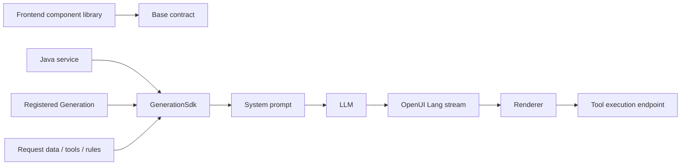

The GenUI Java SDK is the backend prompt-assembly layer for OpenUI. Use it when your service is written in Java and you want the model to generate valid OpenUI Lang without moving prompt construction into the browser.

The SDK does one job: it assembles the system prompt. Your service still owns the REST API, authentication, tenant routing, LLM call, streaming response, and tool execution.

For the same contract and request inputs, the Java assembler is byte-aligned with the TypeScript prompt assembler. The SDK golden tests pin that alignment, so a Java service can produce the same model instructions as the frontend library or Node tooling.



Use the Java SDK when you need one or more of these:

- assemble prompts in a Java service instead of a Node route
- register different UI-generation contracts per product area, tenant, or scenario
- add request-scoped data models, tools, and rules before each LLM call
- keep the system prompt server-side while the frontend only renders generated OpenUI Lang

## Requirements

- Java 21+
- Maven
- `com.huawei.cloudsop:genui-core:0.1.0-SNAPSHOT`

Build and install the SDK from this repository:

```bash
mvn -pl packages/genui-java-sdk install
```

Then add it to your service:

```xml
<dependency>
  <groupId>com.huawei.cloudsop</groupId>
  <artifactId>genui-core</artifactId>
  <version>0.1.0-SNAPSHOT</version>
</dependency>
```

## Mental Model

`GenerationSdk.assemblePrompt(...)` merges three layers:

| Layer                 | Owner        | Lifetime                                                                      |
| --------------------- | ------------ | ----------------------------------------------------------------------------- |
| Base contract         | SDK          | Loaded from the bundled `openui/base-contract.json` resource.                 |
| Registered Generation | Your service | Stored in memory after `sdk.register(...)`. Re-register on service startup.   |
| Request Overlay       | One request  | `dataModel`, one-shot tools, and extra rules passed to `assemblePrompt(...)`. |

The base contract contains the built-in OpenUI DSL contract. A registered Generation adds domain-specific components, component groups, tools, examples, and rules. A Request Overlay adds information that should apply only to one LLM call.

## Minimal SDK Integration

Create one SDK instance for the service process:

```java
import com.huawei.cloudsop.genui.core.GenerationSdk;

GenerationSdk sdk = GenerationSdk.create();
```

`GenerationSdk.create()` loads the default OpenUI base contract from the SDK resources. Use `GenerationSdk.builder().baseContract(...)` only if your deployment supplies a custom base contract.

Register your business generation contract at startup:

```java
import com.huawei.cloudsop.genui.core.ComponentGroup;
import com.huawei.cloudsop.genui.core.ComponentPromptSpec;
import com.huawei.cloudsop.genui.core.contract.GenUIExtension;
import com.huawei.cloudsop.genui.core.ToolAnnotations;
import com.huawei.cloudsop.genui.core.ToolSpec;
import java.util.LinkedHashMap;
import java.util.List;
import java.util.Map;

public final class BillingGeneration {
  public static GenUIExtension create() {
    LinkedHashMap<String, Object> billProps = new LinkedHashMap<>();
    billProps.put("title", Map.of("type", "string"));
    billProps.put("amount", Map.of("type", "number"));

    LinkedHashMap<String, Object> billSchema = new LinkedHashMap<>();
    billSchema.put("type", "object");
    billSchema.put("properties", billProps);
    billSchema.put("required", List.of("title", "amount"));

    LinkedHashMap<String, ComponentPromptSpec> components = new LinkedHashMap<>();
    components.put("BillingCard", new ComponentPromptSpec(
        "Billing card for displaying an invoice period and amount.",
        billSchema));

    LinkedHashMap<String, Object> toolProps = new LinkedHashMap<>();
    toolProps.put("period", Map.of("type", "string"));

    LinkedHashMap<String, Object> inputSchema = new LinkedHashMap<>();
    inputSchema.put("type", "object");
    inputSchema.put("properties", toolProps);
    inputSchema.put("required", List.of("period"));

    return new GenUIExtension(
        "billing",
        "1.0.0",
        components,
        List.of(new ComponentGroup(
            "Billing",
            List.of("BillingCard"),
            List.of("Use BillingCard for invoice summaries."))),
        List.of(new ToolSpec(
            "queryBill",
            "Query billing details by period.",
            inputSchema,
            Map.of(),
            new ToolAnnotations(true, null))),
        List.of("root = Stack([BillingCard(title: \"May invoice\", amount: 128.5)])"),
        List.of("Always render currency values with two decimals."));
  }
}
```

Assemble a system prompt for each LLM request:

```java
import com.huawei.cloudsop.genui.core.DataModelSpec;
import com.huawei.cloudsop.genui.core.GenUIPromptAssemblyResult;
import com.huawei.cloudsop.genui.core.GenUIPromptRequest;
import com.huawei.cloudsop.genui.core.GenerationSdk;
import java.util.List;
import java.util.Map;

GenerationSdk sdk = GenerationSdk.create();
sdk.register(BillingGeneration.create());

GenUIPromptAssemblyResult assembly = sdk.assemblePrompt(new GenUIPromptRequest(
    "billing",
    new DataModelSpec("Current billing page state", Map.of("period", "2026-06")),
    List.of(),
    List.of("Prefer a compact layout for dashboard cards."),
    null,
    null,
    null,
    null));

String systemPrompt = assembly.prompt();
```

Send `systemPrompt` as the system message when calling your LLM. The SDK does not call the model for you.

> Keep schema maps ordered. Component order and JSON Schema property order affect the generated prompt. Build order-sensitive maps with `LinkedHashMap`.

## Spring Boot Service Pattern

A production service usually wraps the SDK in an application service. This wrapper lets you list registrations, fail fast on unknown `extensionId`, and log prompt metadata next to each LLM call.

```java
import com.huawei.cloudsop.genui.core.contract.GenUIExtension;
import com.huawei.cloudsop.genui.core.GenUIPromptAssemblyResult;
import com.huawei.cloudsop.genui.core.GenUIPromptRequest;
import com.huawei.cloudsop.genui.core.GenerationSdk;
import java.util.LinkedHashMap;
import java.util.Map;
import org.springframework.stereotype.Service;

@Service
public class GenuiPromptService {
  private final GenerationSdk sdk;
  private final Map<String, GenUIExtension> registered = new LinkedHashMap<>();

  public GenuiPromptService(GenerationSdk sdk) {
    this.sdk = sdk;
  }

  public synchronized void register(GenUIExtension generation) {
    sdk.register(generation);
    registered.put(generation.extensionId(), generation);
  }

  public synchronized GenUIPromptAssemblyResult assemble(GenUIPromptRequest request) {
    if (request.extensionId() != null && !registered.containsKey(request.extensionId())) {
      throw new IllegalArgumentException("Unknown extensionId: " + request.extensionId());
    }
    return sdk.assemblePrompt(request);
  }
}
```

Configure the SDK as a singleton bean:

```java
import com.huawei.cloudsop.genui.core.GenerationSdk;
import org.springframework.context.annotation.Bean;
import org.springframework.context.annotation.Configuration;

@Configuration
public class GenuiConfig {
  @Bean
  public GenerationSdk generationSdk() {
    return GenerationSdk.create();
  }
}
```

Register seed generations during startup:

```java
import org.springframework.boot.ApplicationArguments;
import org.springframework.boot.ApplicationRunner;
import org.springframework.stereotype.Component;

@Component
public class GenuiSeedRunner implements ApplicationRunner {
  private final GenuiPromptService prompts;

  public GenuiSeedRunner(GenuiPromptService prompts) {
    this.prompts = prompts;
  }

  @Override
  public void run(ApplicationArguments args) {
    prompts.register(BillingGeneration.create());
  }
}
```

The reference service loads seed JSON files from `classpath:seed/*.json`, but direct Java registration works just as well.

## Build the Generate Endpoint

Your `/generate` endpoint should:

1. validate the user prompt
2. assemble the system prompt with `GenerationSdk`
3. call an OpenAI-compatible or internal LLM endpoint
4. stream the model's OpenUI Lang text back to the frontend

```java
import com.huawei.cloudsop.genui.core.DataModelSpec;
import com.huawei.cloudsop.genui.core.GenUIPromptRequest;
import java.util.List;
import java.util.Map;
import org.springframework.http.MediaType;
import org.springframework.http.ResponseEntity;
import org.springframework.web.bind.annotation.PostMapping;
import org.springframework.web.bind.annotation.RequestBody;
import org.springframework.web.bind.annotation.RestController;
import org.springframework.web.servlet.mvc.method.annotation.StreamingResponseBody;

@RestController
public class GenerateController {
  private final GenuiPromptService prompts;
  private final LlmClient llm;

  public GenerateController(GenuiPromptService prompts, LlmClient llm) {
    this.prompts = prompts;
    this.llm = llm;
  }

  @PostMapping(value = "/v1/generate", consumes = MediaType.APPLICATION_JSON_VALUE)
  public ResponseEntity<StreamingResponseBody> generate(@RequestBody GenerateRequest body) {
    if (body.prompt() == null || body.prompt().isBlank()) {
      throw new IllegalArgumentException("prompt is required");
    }

    GenUIPromptRequest request = new GenUIPromptRequest(
        body.extensionId(),
        body.dataModel() == null ? null : new DataModelSpec(null, body.dataModel()),
        body.tools(),
        body.extraRules(),
        null,
        null,
        null,
        null);

    String systemPrompt = prompts.assemble(request).prompt();
    LlmStream stream = llm.openStream(systemPrompt, body.prompt());

    return ResponseEntity.ok()
        .contentType(MediaType.TEXT_PLAIN)
        .body(out -> stream.pipeTo(out));
  }
}
```

`GenerateRequest`, `LlmClient`, and `LlmStream` are service-owned types. The SDK stays independent from any LLM provider.

## Register Components and Tools

A Generation can contribute:

| Field             | Purpose                                                                     |
| ----------------- | --------------------------------------------------------------------------- |
| `components`      | Model-visible component contracts.                                          |
| `componentGroups` | Grouping and usage notes for components.                                    |
| `tools`           | Model-visible tool contracts for `Query(...)`, `Mutation(...)`, and `@Run`. |
| `examples`        | OpenUI Lang examples included in the prompt.                                |
| `additionalRules` | Persistent instructions for this Generation.                                |

Custom components require both sides:

- backend registration so the model knows the component name and props
- frontend `library.extend(...)` registration so the Renderer can render the generated component

Tools also require both sides:

- a `ToolSpec` in the prompt so the model knows how to call the tool
- a server-side executor so the frontend can run generated `Query` or `Mutation` nodes

The reference service exposes tool execution as:

```http
POST /v1/tools/{toolName}/execute
Content-Type: application/json

{ "period": "2026-06" }
```

The response should be JSON matching the tool's `outputSchema`.

## REST Reference Service

`examples/genui-service` is a runnable Spring Boot reference implementation. It wraps the SDK, calls an OpenAI-compatible chat completions endpoint, and exposes the core service contract.

| Endpoint                             | Purpose                                                                |
| ------------------------------------ | ---------------------------------------------------------------------- |
| `GET /v1/generations`                | List registered Generations.                                           |
| `PUT /v1/generations/{extensionId}` | Register or replace one Generation.                                    |
| `POST /v1/prompts/assemble`          | Assemble a system prompt without calling the LLM.                      |
| `POST /v1/generate`                  | Assemble prompt, call the LLM, and stream OpenUI Lang as `text/plain`. |
| `POST /v1/tools/{toolName}/execute`  | Execute a generated tool call.                                         |

Run it from the repository root:

```bash
export LLM_API_KEY="..."
export LLM_BASE_URL="https://your-llm-compatible-base-url/v1"
export LLM_MODEL="your-model"

mvn -pl examples/genui-service spring-boot:run
```

The service listens on port `3001` by default.

Register a Generation over REST:

```bash
curl -X PUT http://localhost:3001/v1/generations/team-a-billing \
  -H "Content-Type: application/json" \
  -d '{
    "version": "1.0.0",
    "components": {
      "BillingCard": {
        "signature": "BillingCard(title: string, amount: number)",
        "description": "Billing card for invoice summaries."
      }
    },
    "tools": [
      {
        "name": "queryBill",
        "description": "Query billing details by period.",
        "inputSchema": {
          "type": "object",
          "properties": {
            "period": { "type": "string" }
          },
          "required": ["period"]
        },
        "annotations": { "readOnlyHint": true }
      }
    ],
    "additionalRules": [
      "Always render currency values with two decimals."
    ]
  }'
```

Preview the assembled prompt:

```bash
curl -X POST http://localhost:3001/v1/prompts/assemble \
  -H "Content-Type: application/json" \
  -d '{"extensionId":"team-a-billing"}'
```

Generate OpenUI Lang:

```bash
curl -N -X POST http://localhost:3001/v1/generate \
  -H "Content-Type: application/json" \
  -d '{
    "extensionId": "team-a-billing",
    "prompt": "Show the June invoice summary."
  }'
```

See `examples/genui-service/register-extension.http` for a longer copy-paste walkthrough.

## Registration Semantics

- Re-registering the same `extensionId` replaces the entire Generation.
- Registrations are in memory unless your service persists and reloads them.
- Component names must not collide with the base contract or repeat inside the Generation.
- Tool names must not collide with the base contract, the registered Generation, or request overlay tools.
- `ComponentGroup.components` must reference known component names.
- `GenerationSdkException` is the SDK validation error type. Map name-collision errors to `409 Conflict`; map other validation errors to `400 Bad Request`.

One subtle service choice: the SDK itself falls back to the base contract when `assemblePrompt(...)` receives an unknown non-null `extensionId`. The reference service deliberately guards this and returns `404`. Most services should do the same so callers notice a bad `extensionId`.

## Request Overlay

Use Request Overlay for data or tools that should not be persisted:

```java
new GenUIPromptRequest(
    "billing",
    new DataModelSpec("Selected customer", customerState),
    requestScopedTools,
    List.of("Only use data present in this request."),
    null,
    null,
    true,
    true);
```

| Field        | Behavior                                                                             |
| ------------ | ------------------------------------------------------------------------------------ |
| `dataModel`  | Adds request-specific host data into the prompt.                                     |
| `tools`      | Adds one-shot tools for this request only.                                           |
| `extraRules` | Adds one-shot rules after registered rules.                                          |
| `editMode`   | Enables incremental editing instructions.                                            |
| `inlineMode` | Allows mixed text and OpenUI Lang responses.                                         |
| `toolCalls`  | Enables tool-call instructions. Defaults are handled by the prompt assembler.        |
| `bindings`   | Enables reactive binding instructions. Defaults are handled by the prompt assembler. |

Log `GenUIPromptAssemblyMetadata` with every model call. It includes the base contract version, selected Generation version, registered tool names, and request tool names.

## Production Checklist

- Create one `GenerationSdk` instance per service process.
- Re-register seed or persisted Generations on startup.
- Keep backend component contracts and frontend renderer registrations in sync.
- Use `LinkedHashMap` for component maps and JSON Schema maps where order matters.
- Treat `promptOverride` as debug-only if you expose it.
- Stream OpenUI Lang text exactly as the model emits it; let the frontend Renderer parse it.
- Implement `/tools/{toolName}/execute` for every tool you expose in a prompt.
- Keep the assembled system prompt server-side; the frontend only needs generated OpenUI Lang and the matching component library.

## Verify Your Integration

Run the SDK and reference service tests:

```bash
mvn -pl packages/genui-java-sdk test
mvn -pl examples/genui-service test
```

The SDK golden tests verify byte alignment with the TypeScript prompt assembler. The service tests verify REST registration, prompt assembly, streaming behavior, seed recovery, and tool execution.
