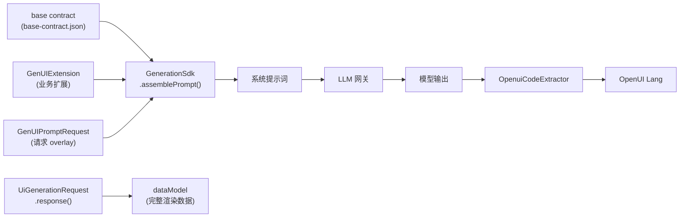

`genui-java-sdk` 是面向后端 SmartCanvasService 的 Java 21 SDK。它把 DSLEngine 的 base contract、业务扩展 contract、请求数据和 prompt overlay 组合起来，生成模型可用的系统提示词，并可直接调用 LLM 得到 OpenUI Lang。

## 架构



SDK 承担两个职责：

1. **Prompt 组装权威**。`PromptAssembler` 是 `packages/lang-core/src/parser/prompt.ts` 的 `generatePrompt` 的逐字节 Java 移植（design D9）。base contract 的 builtins 来自前端导出的 manifest，其余 section 与 TypeScript 实现完全对齐。跨语言一致性由 `PromptGoldenTest` 锁定。
2. **LLM 驱动**。`GenUiGenerator` 封装组装 → 请求构造 → 同步/流式调用 → 代码提取的完整链路，服务层可以直接使用。

## SDK 职责边界

SDK **只**负责 prompt 组装、LLM 调用和代码提取。它**不**包含 OpenUI Lang 解析器、DSL 校验器或流式 statement gate——这些是 SmartCanvasService / GenUI Service 层的职责。

| SDK 负责 | SDK 不负责（服务层） |
| --- | --- |
| base contract 加载与扩展注册校验 | OpenUI Lang lexer/parser |
| prompt 组装（含 Characterization） | Generated DSL Validation（完整产物校验） |
| LLM 同步/流式调用 | Streaming IR Validation（流式行校验） |
| `OpenuiCodeExtractor` 从 markdown 提取代码 | Streaming Statement Repair / Fail-Fast Reask |
| `RenderStreamEnvelope` 帧定义 | 帧的 SSE 序列化与缓存编排 |

`OpenuiCodeExtractor` 是基于正则的代码块提取器，它从模型输出的 markdown fence 中提取 OpenUI Lang 文本，不做语法校验。服务层在拿到提取后的 DSL 后，再决定是否做解析、校验或重问。

## 快速上手

### 创建生成器

```java
import com.huawei.cloudsop.genui.core.llm.GenUiGenerator;
import com.huawei.cloudsop.genui.core.llm.GenUiLlmConfig;

GenUiLlmConfig config =
    GenUiLlmConfig.builder()
        .endpoint("/rest/netrsn/v1/chat/completions")
        .defaultModel("qwen3.6-27b")
        .temperature(0)
        .enableThinking(false)
        .jsonObjectResponse(false)
        .putHeader("X-Tenant-Id", tenantId)
        .build();

GenUiGenerator generator = GenUiGenerator.create(config);
```

默认请求体期望模型直接返回 OpenUI Lang 文本，不强制 `response_format.type=json_object`。如果旧网关要求 JSON object，可以显式打开 `jsonObjectResponse(true)`。详见 [LLM Transport](./llm-transport)。

### 同步生成

```java
UiGenerationRequest request =
    UiGenerationRequest.builder()
        .userInput("生成一个告警概览页面，先展示统计，再展示告警列表")
        .response(response)
        .suggestion("优先使用基础组件，不要编造未注册业务组件")
        .build();

GenUiGenerationResult result = generator.generate(request);

String dsl = result.dsl();
Map<String, Object> dataModel = result.dataModel();
```

`dataModel()` 返回用于前端渲染的完整数据。Characterization 只会压缩 prompt 中的数据副本，不会缩减这里的渲染数据。详见 [Request Model](./request-model)。

### 流式生成

```java
generator.generateStream(
    request,
    envelope -> {
      out.write(("data: " + toJson(envelope) + "\n\n").getBytes(StandardCharsets.UTF_8));
      out.flush();
    });
```

帧顺序固定：首帧 `dataModel`（seq=0），随后若干 `dsl`（seq 递增），失败时 `error`，结束 `done`。详见 [Streaming](./streaming)。

### 注册业务扩展

```java
GenUIExtension extension = objectMapper.readValue(extensionJson, GenUIExtension.class);
generator.register(extension);
```

注册时会校验组件名/工具名是否与 base contract 或同 extension 内已有定义冲突。详见 [Extension Registration](./extension-registration)。

## 子文档

| 文档 | 内容 |
| --- | --- |
| [Extension Registration](./extension-registration) | `GenUIExtension` 结构、`ComponentPropsSchema` 校验规则、工具与组件冲突、JSON 示例 |
| [Request Model](./request-model) | `UiGenerationRequest` 字段、请求到 prompt 的映射、用户消息组装 |
| [Prompt Assembly](./prompt-assembly) | `PromptAssembler` 结构、Request Overlay、Contract Version、golden 测试 |
| [Characterization](./characterization) | 大数据 Characterization 配置、双路径不变量、Enum Domain、Sidecar |
| [LLM Transport](./llm-transport) | `GenUiLlmConfig`、`LlmTransport` SPI、`RestfulLlmTransport`、协议层 |
| [Streaming](./streaming) | `RenderStreamEnvelope`、`generateStream` 流程、SSE 协议、错误处理 |

## 生成 base contract

base contract 来自前端 `@cloudsop/openui-react-ui-dsl`：

```bash
pnpm --dir packages/react-ui-dsl run generate:base-contract
```

该命令会更新 Java SDK 的默认资源：

```text
packages/genui-java-sdk/src/main/resources/openui/base-contract.json
```

`GenerationSdk.create()` 会自动加载该资源。测试可以用 `GenerationSdk.builder().baseContract(...).build()` 覆盖。

## 测试

```bash
cd packages/genui-java-sdk
mvn test
mvn -Dtest=PromptGoldenTest test
```

修改 prompt assembler、builtins 或 base contract 后，还应重新生成并验证 cross-language golden 文件。
