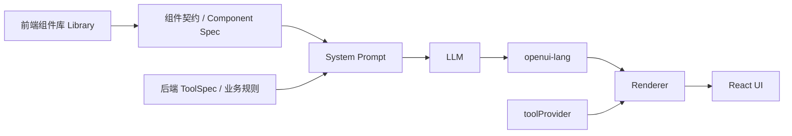

OpenUI 的扩展不是只改前端，也不是只改 prompt。一个可用的扩展通常由两部分组成：

1. 前端运行时知道怎么渲染：把组件注册到 `Library`，并把 tools 接到 `<Renderer />` 的 `toolProvider`。
2. 后端生成侧知道能生成什么：把组件契约、tool 契约、示例和业务规则注册到 prompt assembly 流程。

如果只做前端，模型不知道这个组件存在。如果只做后端，模型可能会生成组件，但前端无法渲染。

## 扩展对象

| 你想扩展 | 前端要做什么 | 后端要做什么 |
| --- | --- | --- |
| 新组件 | `defineComponent(...)`，再 `createLibrary(...)` 或 `library.extend(...)` | 注册同名 Component Contract，让模型知道签名和用途 |
| 新 tool | 给 `<Renderer />` 传 `toolProvider`，执行 `Query()` / `Mutation()` | 注册 `ToolSpec`，让模型知道 tool 名、入参、出参和读写语义 |
| 业务规则 | 在组件描述、`componentGroups.notes`、`PromptOptions.additionalRules` 中表达 | 在扩展（GenUIExtension）或 Request Overlay 的 `additionalRules` / `extraRules` 中表达 |
| 动态数据 | 给 `<Renderer />` 传 `dataModel` 或让 DSL 使用 `Query()` | 在 assemble/generate 请求里传 `dataModel`，或注册可调用 tools |

## 核心链路



组件名、参数顺序和 tool 名是前后端对齐的关键。OpenUI Lang 的组件调用是位置参数，不是命名参数，因此 schema 或 signature 的字段顺序会影响模型生成的参数顺序。

## 前端扩展组件

前端组件使用 `defineComponent(...)` 定义，再通过 `createLibrary(...)` 创建新的组件库，或通过现有库的 `extend(...)` 加到内置组件库上。

```tsx
import { defineComponent, dslLibrary } from "@openuidev/react-ui-dsl";
import { z } from "zod";

const BillingCard = defineComponent({
  name: "BillingCard",
  description: "显示账单金额、周期和状态。",
  props: z.object({
    title: z.string(),
    amount: z.number(),
    currency: z.enum(["CNY", "USD"]).optional(),
    status: z.enum(["paid", "unpaid", "overdue"]).optional(),
  }),
  component: ({ props }) => (
    <section className="billing-card">
      <div>{props.title}</div>
      <strong>
        {props.currency ?? "CNY"} {props.amount.toFixed(2)}
      </strong>
      {props.status ? <span>{props.status}</span> : null}
    </section>
  ),
});

export const billingLibrary = dslLibrary.extend({
  components: [BillingCard],
  componentGroups: [
    {
      name: "Billing",
      components: ["BillingCard"],
      notes: ["账单场景优先使用 BillingCard，不要用通用 Card 拼装金额。"],
    },
  ],
  contractVersion: "billing-1.0.0",
});
```

然后把扩展后的 library 传给渲染入口：

```tsx
import { Renderer } from "@openuidev/react-ui-dsl";
import { billingLibrary } from "./billing-library";

export function Preview({ code }: { code: string }) {
  return <Renderer response={code} library={billingLibrary} />;
}
```

### 组件设计建议

- `name` 要稳定，后端注册和模型输出都依赖它。
- `props` 尽量扁平，必填字段放前面，可选字段放后面。
- 父子组件使用 `Child.ref`，不要把复杂对象深嵌在一个大 prop 里。
- `description` 写给模型看，要说明什么时候用这个组件。
- `componentGroups.notes` 适合写“优先使用”“不要嵌套”“图表选择规则”这类生成约束。

## 后端注册组件契约

后端组件契约只描述“模型可以生成什么”，不包含 React 实现。React 实现仍然由前端 `Library` 提供。

### 用 CLI 导出 Extension JSON

后端契约不用手写——把你的扩展写成一个**完整 extension 对象**（`extensionId` / `version`，加上你传给 `dslLibrary.extend(...)` 的 `components` / `componentGroups` 等），再用 CLI `openui generate-extension` 把其中的真实组件编译成 renderer-free 的组件契约（只含 `description` + `propsSchema`，不含 React 实现）。组件名和 `propsSchema.properties` 顺序天然和前端 Zod props 一致：

```ts
// billing-extension.ts
import { BillingCard } from "./billing-library"; // 你定义并 export 的组件

// 完整 extension 对象：同一个对象也可传给 dslLibrary.extend(billingExtension) 用于前端渲染
export const billingExtension = {
  extensionId: "team-a-billing",
  version: "1.0.0",
  components: [BillingCard],
  componentGroups: [
    { name: "Billing", components: ["BillingCard"], notes: ["账单场景优先使用 BillingCard。"] },
  ],
};
```

```bash
npx @openuidev/cli@latest generate-extension ./billing-extension.ts --out billing-extension.json
```

> CLI 会校验每个组件的必填 props 排在可选 props 之前（对应 openui-lang 的位置参数顺序），否则导出失败。
> `extensionId` / `version` 默认取自对象，可用 `--extension-id` / `--version` 覆盖（便于 CI 注入版本）。`components` 之外的 `componentGroups` / `tools` / `examples` / `additionalRules` 有就原样透传。

写出的 `billing-extension.json` 就是一个**可直接注册的 `GenUIExtension` 形 JSON**：顶层带 `extensionId` / `version`，`components` 由真实组件编译成 `propsSchema`（JSON Schema）描述，且只含你扩展的组件，不含 base 内置件：

```json
{
  "extensionId": "team-a-billing",
  "version": "1.0.0",
  "components": {
    "BillingCard": {
      "description": "显示账单金额、周期和状态。账单场景优先使用该组件。",
      "propsSchema": {
        "type": "object",
        "properties": {
          "title": { "type": "string" },
          "amount": { "type": "number" },
          "currency": { "type": "string", "enum": ["CNY", "USD"] },
          "status": { "type": "string", "enum": ["paid", "unpaid", "overdue"] }
        },
        "required": ["title", "amount"]
      }
    }
  },
  "componentGroups": [
    { "name": "Billing", "components": ["BillingCard"], "notes": ["账单场景优先使用 BillingCard。"] }
  ]
}
```

后端拿到这段 JSON，反序列化成 `GenUIExtension` 直接注册（见下方「直接嵌入 Java SDK」）。因为 `components` 由前端组件定义直接编译，`propsSchema.properties` 的字段顺序和前端 Zod props 顺序天然对齐，不用人工核对。

### 通过 REST 注册

当前 GenUI Service 的 REST 参考实现使用 `/v1/extensions` 管理扩展。`extensionId` 用来隔离不同业务扩展，重复注册同一个 `extensionId` 会整体替换旧契约。

```http
PUT http://localhost:3001/v1/extensions/team-a-billing
Content-Type: application/json

{
  "version": "1.0.0",
  "components": {
    "BillingCard": {
      "description": "显示账单金额、周期和状态。账单场景优先使用该组件。",
      "propsSchema": {
        "type": "object",
        "properties": {
          "title": { "type": "string" },
          "amount": { "type": "number" },
          "currency": { "type": "string", "enum": ["CNY", "USD"] },
          "status": { "type": "string", "enum": ["paid", "unpaid", "overdue"] }
        },
        "required": ["title", "amount"]
      }
    }
  },
  "componentGroups": [
    {
      "name": "Billing",
      "components": ["BillingCard"],
      "notes": ["账单场景优先使用 BillingCard。"]
    }
  ],
  "additionalRules": ["金额保留两位小数。"]
}
```

生成时选择这个扩展：

```http
POST http://localhost:3001/v1/prompts/assemble
Content-Type: application/json

{
  "extensionId": "team-a-billing"
}
```

常见语义：

- `extensionId` 隔离一套业务扩展。
- `version` 是扩展契约版本，建议随业务组件或 tool 变化递增。
- `components` 只放扩展组件，base contract 由 DSLEngine / SDK 提供。
- 组件名或 tool 名不能和 base contract 冲突，冲突返回 `409`。
- 参考服务是内存注册，服务重启后需要调用方重新注册。

### 直接嵌入 Java SDK

如果你直接嵌入 Java Generation SDK，注册入口只有一个：`sdk.register(GenUIExtension)`。扩展契约就是上面 `generate-extension` 导出的那段 JSON（也可以来自配置中心、文件或数据库），用你自己的 JSON 库反序列化成 `GenUIExtension` 后直接注册，不必在 Java 里手搓嵌套 `Map`：

```java
import com.fasterxml.jackson.databind.ObjectMapper;
import com.huawei.cloudsop.genui.core.GenerationSdk;
import com.huawei.cloudsop.genui.core.contract.GenUIExtension;
import java.nio.file.Files;
import java.nio.file.Path;

GenerationSdk sdk = GenerationSdk.create();

// billing-extension.json 即上面 generate-extension 的导出产物
String extensionJson = Files.readString(Path.of("billing-extension.json"));
GenUIExtension extension = new ObjectMapper().readValue(extensionJson, GenUIExtension.class);
sdk.register(extension);
```

> 组件务必用 `propsSchema` 描述，不要用旧的 `signature` 形态。`ComponentPromptSpec` 的规范构造器是 `(description, propsSchema)`，Jackson 按它绑定 record；JSON 里的 `signature` 会被当未知字段静默丢掉，导致组件在 prompt 里没有 props。JSON 对象的键顺序即字段顺序，反序列化时会被保留。

## 扩展 tools

OpenUI 的 tool 也要前后端两侧对齐：

- 后端注册 `ToolSpec`，让模型知道可以在 DSL 里写 `Query("toolName", ...)` 或 `Mutation("toolName", ...)`。
- 前端提供 `toolProvider`，让 Renderer 在运行时真正执行这个 tool。

### 注册 tool 契约

把 tool 放进扩展（GenUIExtension）：

```http
PUT http://localhost:3001/v1/extensions/team-a-billing
Content-Type: application/json

{
  "version": "1.0.0",
  "tools": [
    {
      "name": "queryBill",
      "description": "按账期查询账单明细。",
      "inputSchema": {
        "type": "object",
        "properties": {
          "period": { "type": "string" }
        },
        "required": ["period"]
      },
      "outputSchema": {
        "type": "object",
        "properties": {
          "rows": {
            "type": "array",
            "items": {
              "type": "object",
              "properties": {
                "title": { "type": "string" },
                "amount": { "type": "number" }
              }
            }
          }
        }
      },
      "annotations": { "readOnlyHint": true }
    }
  ],
  "examples": [
    "bill = Query(\"queryBill\", {period: \"2026-06\"}, {rows: []})\\nroot = Table([Col(\"账单\", bill.rows.title), Col(\"金额\", bill.rows.amount)])"
  ]
}
```

也可以只在单次请求里传 Request Overlay。Overlay 不会持久化，适合“这一次生成才有”的附加规则：

```json
{
  "extensionId": "team-a-billing",
  "extraRules": ["账单金额一律按用户所在区域的货币单位展示。"]
}
```

### 执行 tool

最简单的方式是在前端传函数表：

```tsx
<Renderer
  response={code}
  library={billingLibrary}
  toolProvider={{
    queryBill: async (args) => {
      const res = await fetch("/api/billing/query", {
        method: "POST",
        headers: { "Content-Type": "application/json" },
        body: JSON.stringify(args),
      });
      return res.json();
    },
  }}
/>
```

如果你使用 GenUI Service 的参考 tool endpoint，可以把 Renderer 的 tool 调用转发到 `/v1/tools/{toolName}/execute`：

```tsx
const serviceToolProvider = {
  async callTool({ name, arguments: args }: { name: string; arguments?: Record<string, unknown> }) {
    const res = await fetch(`/v1/tools/${encodeURIComponent(name)}/execute`, {
      method: "POST",
      headers: { "Content-Type": "application/json" },
      body: JSON.stringify(args ?? {}),
    });

    if (!res.ok) throw new Error(await res.text());
    return { content: [], structuredContent: await res.json() };
  },
};

<Renderer response={code} library={billingLibrary} toolProvider={serviceToolProvider} />;
```

模型生成的 DSL 大致会长这样：

```text
$period = "2026-06"
bill = Query("queryBill", {period: $period}, {rows: []})
root = Stack([filter, table])
filter = Select("period", $period, [SelectItem("2026-06", "2026-06"), SelectItem("2026-05", "2026-05")])
table = Table([Col("账单", bill.rows.title), Col("金额", bill.rows.amount)])
```

写操作用 `Mutation()`，并通过按钮的 `Action([@Run(...)])` 触发：

```text
$billId = ""
payResult = Mutation("payBill", {id: $billId})
bill = Query("queryBill", {period: "2026-06"}, {rows: []})
payButton = Button("支付", Action([@Run(payResult), @Run(bill), @Reset($billId)]))
```

## 生成请求接入

### 静态组件库

如果你的组件库在构建时确定，可以用 CLI 生成 system prompt：

```bash
npx @openuidev/cli@latest generate ./src/billing-library.ts --out src/generated/system-prompt.txt
```

后端读取这个 prompt，和用户消息一起发给 LLM。前端用同一个 `billingLibrary` 渲染模型返回的 OpenUI Lang。

### 动态扩展

如果不同业务线有不同组件、tools 或规则，使用 Java Generation SDK 或 GenUI Service：

1. 服务启动时注册每个业务的 `extensionId`。
2. 每次生成时传 `extensionId`、`dataModel`、Request Overlay。
3. 后端 assemble system prompt，调用 LLM。
4. 流式返回 `openui-lang`。
5. 前端按同一个 `extensionId` 选择匹配的扩展 library，并传入 `toolProvider`。

参考请求：

```http
POST http://localhost:3001/v1/generate
Content-Type: application/json

{
  "prompt": "生成 6 月账单总览，包含金额表格和异常账单提醒。",
  "extensionId": "team-a-billing",
  "dataModel": {
    "currentPeriod": "2026-06"
  },
  "extraRules": ["页面必须先展示总金额，再展示明细。"]
}
```

`promptOverride` 只适合调试。生产请求应优先使用注册契约和 Request Overlay，而不是整段替换 system prompt。

## 前后端对齐清单

上线一个扩展前，逐项检查：

- 前端 `defineComponent.name` 和后端组件名完全一致。
- 前端 Zod props 顺序和后端 `propsSchema.properties` 顺序一致。
- required 字段在 optional 字段之前。
- 后端注册的组件都能在前端 library 中渲染。
- 后端注册的 tool 都能被前端 `toolProvider` 执行。
- tool 的 `inputSchema` 和真实执行器入参一致。
- tool 的 `outputSchema` 和真实返回值一致，Query 默认值能表达同样形状。
- `extensionId` 和前端选择的扩展 library 一一对应。
- 注册接口在服务启动时可重复执行，因为参考实现不持久化运行时注册。
- prompt 里有 1 到 2 个业务示例，尤其是 tool + component 组合示例。

## 常见问题

**模型生成了组件，但页面不显示。**

通常是前端 library 没注册这个组件，或组件名不一致。检查 `Renderer` 使用的 `library` 是否是扩展后的 library。

**模型不会使用新组件。**

检查后端是否注册了组件契约，`componentGroups` 是否包含它，`description` 和 `notes` 是否足够明确。复杂组件建议提供一个 `examples`。

**Query 报 `tool-not-found`。**

模型知道了 tool，但 Renderer 的 `toolProvider` 没有同名执行器。后端 `ToolSpec.name`、DSL 中的字符串和前端执行器 key 必须一致。

**注册返回 `409`。**

组件名或 tool 名和 base contract 或同一扩展内已有名称冲突。换一个业务前缀更明确的名字，例如 `BillingCard` 而不是 `Card`。

**修改了扩展但生成结果没变化。**

确认服务是否重新注册了对应 `extensionId`，请求是否传了正确的 `extensionId`，以及前端是否切换到了匹配的扩展 library。
