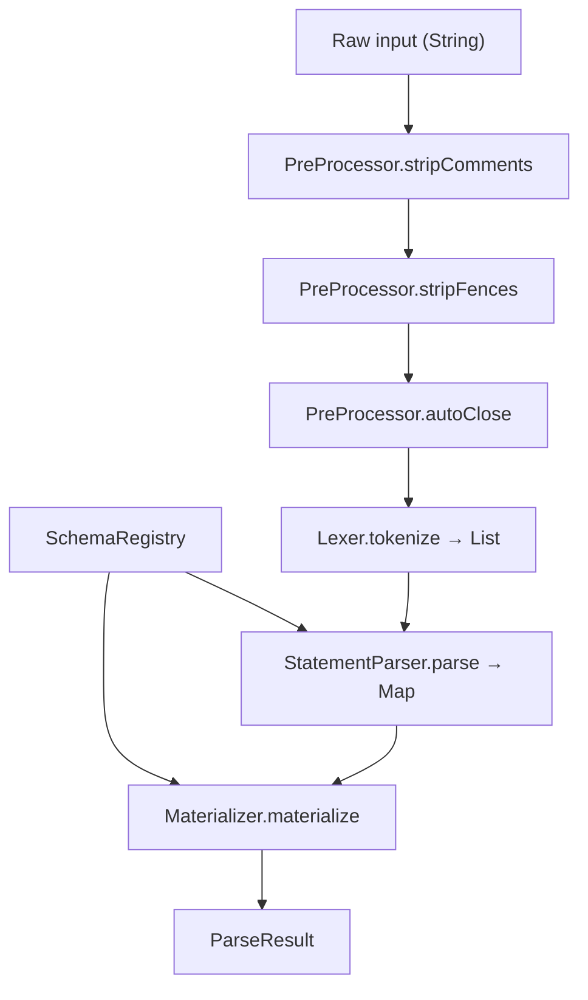
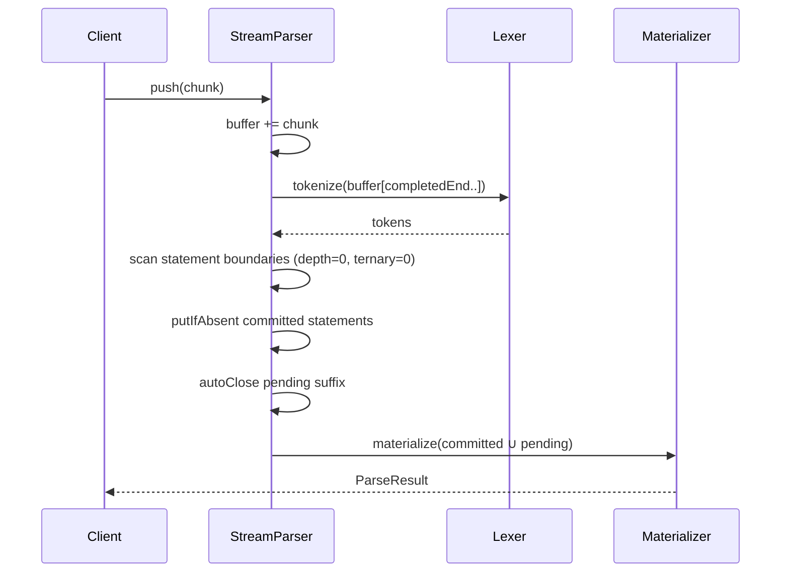
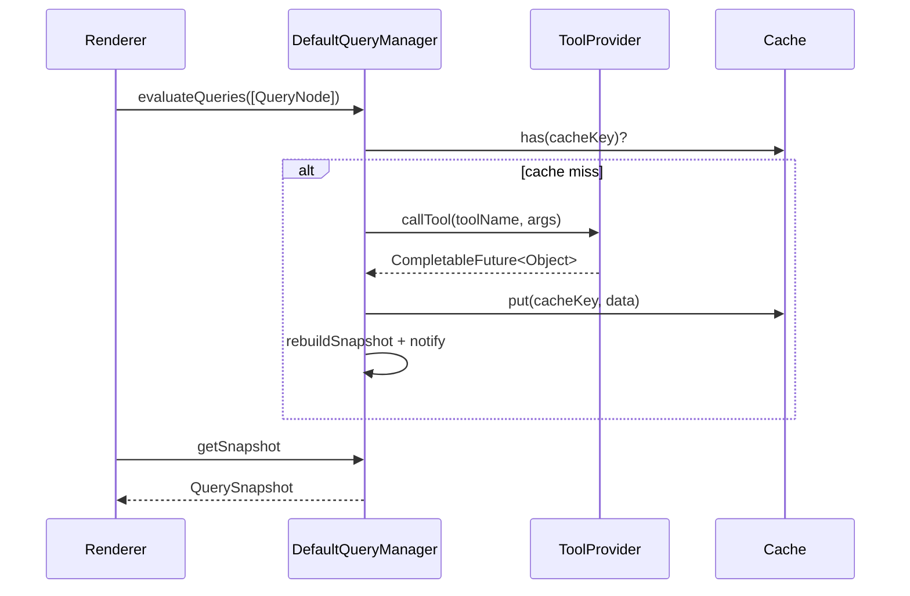

# Design Document — lang-core Java 21 Rewrite

## Overview

This document describes the technical architecture for rewriting the **complete** `@openuidev/lang-core` package in Java 21. The scope covers every exported symbol in the TypeScript package:

| TypeScript module | Java package |
|---|---|
| `parser/lexer.ts`, `parser/tokens.ts` | `dev.openui.langcore.lexer` |
| `parser/ast.ts`, `parser/expressions.ts`, `parser/statements.ts` | `dev.openui.langcore.parser.ast`, `.parser` |
| `parser/materialize.ts`, `parser/types.ts` | `dev.openui.langcore.parser` |
| `parser/merge.ts` | `dev.openui.langcore.merge` |
| `parser/prompt.ts` | `dev.openui.langcore.prompt` |
| `reactive.ts` | `dev.openui.langcore.reactive` |
| `library.ts` | `dev.openui.langcore.library` |
| `runtime/store.ts` | `dev.openui.langcore.store` |
| `runtime/evaluator.ts`, `runtime/evaluate-tree.ts`, `runtime/evaluate-prop.ts` | `dev.openui.langcore.runtime` |
| `runtime/queryManager.ts` | `dev.openui.langcore.query` |
| `runtime/mcp.ts` | `dev.openui.langcore.mcp` |
| `runtime/toolProvider.ts` | `dev.openui.langcore.query` |
| `runtime/state-field.ts` | `dev.openui.langcore.runtime` |
| `utils/validation.ts` | `dev.openui.langcore.util` |

---

## Technology Choices

### Java Version: Java 21 (LTS)

| Java 21 Feature | Usage |
|---|---|
| `sealed interface` + `permits` | AST node hierarchy, `ActionStep`, `Token` discriminants |
| `record` | All data-carrying types (`Token`, `ParseResult`, `ValidationError`, `QueryNode`, …) |
| Pattern-matching `switch` | Evaluator, statement parser, merge GC |
| `LinkedHashMap` | Statement map (insertion-order preserved — critical for root selection) |
| `CopyOnWriteArraySet` | Listener sets in `Store` and `QueryManager` |
| `CompletableFuture` | Async tool calls in `QueryManager` |
| `ScheduledExecutorService` | Auto-refresh interval timers (`setInterval` equivalent) |
| `WeakHashMap` as identity set | Reactive schema marker (`reactiveSchemas` WeakSet equivalent) |
| Text blocks | Test fixtures |

### Dependencies: Zero External Runtime Dependencies

| TypeScript dependency | Java replacement |
|---|---|
| `JSON.parse` (string unescaping) | `JsonStringUtil` — hand-written state machine |
| `JSON.stringify` (stable cache key) | `StableJson.stringify` — hand-written stable serializer |
| `zod` (schema definition + introspection) | `PropSchemaBuilder` — fluent builder; `SchemaRegistry` — JSON Schema store |
| `@modelcontextprotocol/sdk` | Optional — `McpClientLike` interface (duck-typed) |

Only compile-scope (test) dependency: JUnit Jupiter 5.x.

### Build Tool: Maven

```
lang-core-java/
├── pom.xml
└── src/
    ├── main/java/dev/openui/langcore/
    └── test/java/dev/openui/langcore/
```

`pom.xml` dependencies:

```xml
<dependencies>
  <!-- NO runtime dependencies -->
  <dependency>
    <groupId>org.junit.jupiter</groupId>
    <artifactId>junit-jupiter</artifactId>
    <version>5.10.2</version>
    <scope>test</scope>
  </dependency>
</dependencies>
<build>
  <plugins>
    <plugin>
      <groupId>org.apache.maven.plugins</groupId>
      <artifactId>maven-compiler-plugin</artifactId>
      <configuration><release>21</release></configuration>
    </plugin>
  </plugins>
</build>
```

---

## Complete Package Structure

```
dev.openui.langcore
│
├── LangCore.java                    ← public static factory façade
│
├── lexer/
│   ├── TokenType.java               ← enum (35 variants)
│   ├── Token.java                   ← record(TokenType, Object value)
│   └── Lexer.java                   ← stateful char-by-char scanner
│
├── parser/
│   ├── ast/
│   │   ├── Node.java                ← sealed interface (root of AST)
│   │   ├── LiteralNode.java         ← record (Num/Str/Bool/Null)
│   │   ├── RefNode.java             ← record
│   │   ├── StateRefNode.java        ← record
│   │   ├── RuntimeRefNode.java      ← record
│   │   ├── AssignNode.java          ← record ($var = expr inside expression)
│   │   ├── BinaryNode.java          ← record
│   │   ├── UnaryNode.java           ← record
│   │   ├── MemberNode.java          ← record
│   │   ├── TernaryNode.java         ← record
│   │   ├── CallNode.java            ← record
│   │   ├── BuiltinCallNode.java     ← record
│   │   ├── ElementNode.java         ← record
│   │   ├── ArrayNode.java           ← record
│   │   └── ObjectNode.java          ← record
│   ├── Statement.java               ← sealed interface (Value/State/Query/Mutation/Null)
│   ├── PreProcessor.java            ← fence strip, comment strip, autoClose
│   ├── StatementParser.java         ← top-level statement loop
│   ├── ExpressionParser.java        ← Pratt parser
│   ├── Materializer.java            ← AST→ParseResult, validation, root selection
│   ├── ParseResult.java             ← record
│   ├── ParseMeta.java               ← record
│   ├── OneShot.java                 ← createParser() analogue
│   └── StreamParser.java            ← createStreamingParser() analogue
│
├── merge/
│   └── Merger.java                  ← mergeStatements + GC
│
├── prompt/
│   ├── PromptSpec.java              ← record (root, components, groups, tools, options)
│   ├── ComponentPromptSpec.java     ← record (signature, description)
│   ├── ToolSpec.java                ← record (name, description, inputSchema, outputSchema, annotations)
│   └── PromptGenerator.java        ← generatePrompt(PromptSpec) → String
│
├── reactive/
│   └── ReactiveSchemas.java        ← markReactive / isReactiveSchema (WeakHashMap identity set)
│
├── library/
│   ├── PropDef.java                 ← record (name, required, defaultValue, typeAnnotation, isArray, isReactive)
│   ├── ComponentDef.java            ← record (name, List<PropDef>, description, component: Object)
│   ├── ComponentGroup.java          ← record (name, List<String> components, List<String> notes)
│   ├── Library.java                 ← interface (components, prompt, toJSONSchema)
│   ├── LibraryDefinition.java       ← record (components, componentGroups, root)
│   └── Libraries.java              ← static factory: defineComponent / createLibrary
│
├── store/
│   └── Store.java                   ← interface + DefaultStore (Map + CopyOnWriteArraySet)
│
├── runtime/
│   ├── EvaluationContext.java       ← interface (getState, resolveRef, extraScope)
│   ├── Evaluator.java               ← evaluate(Node, EvaluationContext) → Object
│   ├── PropEvaluator.java           ← evaluateElementProps
│   ├── ReactiveAssign.java          ← record (target, expr) — framework adapter signal
│   ├── Builtins.java                ← @Count, @Sort, @Filter, @Each, Action, @Set, …
│   └── StateField.java              ← record + resolveStateField
│
├── query/
│   ├── ToolProvider.java            ← interface: callTool(name, args) → CompletableFuture<Object>
│   ├── ToolNotFoundError.java       ← checked exception
│   ├── QueryNode.java               ← record
│   ├── MutationNode.java            ← record
│   ├── MutationResult.java          ← record (status, data, error)
│   ├── QuerySnapshot.java           ← record (data map + loading/refetching/errors lists)
│   ├── QueryManager.java            ← interface
│   └── DefaultQueryManager.java    ← implementation (CompletableFuture + ScheduledExecutorService)
│
├── mcp/
│   ├── McpClientLike.java           ← interface (duck-typed MCP client)
│   ├── McpToolError.java            ← runtime exception
│   └── McpAdapter.java             ← wraps McpClientLike → ToolProvider, extractToolResult
│
└── util/
    ├── JsonStringUtil.java          ← double-quote string unescape (replaces JSON.parse)
    ├── StableJson.java              ← stable JSON serializer (replaces JSON.stringify for cache keys)
    └── Validation.java              ← builtInValidators, parseRules, validate
```

---

## Component Design

### 1. Lexer (`dev.openui.langcore.lexer`)

Single-pass stateful scanner. Never throws; swallows unrecognized characters silently (Req 1 AC17).

```java
public enum TokenType {
    NUM, STR, TRUE, FALSE, NULL,
    IDENT, TYPE, STATE_VAR, BUILTIN_CALL,
    LPAREN, RPAREN, LBRACK, RBRACK, LBRACE, RBRACE,
    COMMA, COLON, DOT, QUESTION,
    EQUALS, EQ_EQ, NOT, NOT_EQ,
    GREATER, GREATER_EQ, LESS, LESS_EQ,
    AND, OR, PLUS, MINUS, STAR, SLASH, PERCENT,
    NEWLINE, EOF
}

public record Token(TokenType type, Object value) {
    public String stringValue() { return (String) value; }
    public double numValue()    { return (Double) value; }
}
```

Key rules:
- `&&` / `&` → `AND`; `||` / `|` → `OR` (Req 1 AC7)
- `-` context: value-producing token predecessor → `MINUS`; digit follows → negative `NUM` (Req 1 AC12)
- Double-quoted strings: delegated to `JsonStringUtil.unescape`; unterminated → append `"` before parsing (Req 1 AC9)

---

### 2. Pre-Processor (`dev.openui.langcore.parser.PreProcessor`)

```java
public final class PreProcessor {
    public static String stripComments(String src) { … }   // // and # outside strings
    public static String stripFences(String src) { … }     // ```-fenced extraction
    public static AutoCloseResult autoClose(String src) { … }
}

public record AutoCloseResult(String text, boolean wasIncomplete) {}
```

`autoClose` uses a `Deque<Character>` bracket stack + `char openQuote` for string tracking. Always returns valid output for any string input (Req 8 AC1-4).

---

### 3. AST Node Hierarchy (`parser/ast/`)

```java
public sealed interface Node permits
    LiteralNode, RefNode, StateRefNode, RuntimeRefNode,
    AssignNode, BinaryNode, UnaryNode, MemberNode,
    TernaryNode, CallNode, BuiltinCallNode,
    ElementNode, ArrayNode, ObjectNode {}
```

Key records:

```java
public record ElementNode(
    String typeName,
    Map<String, Node> props,      // LinkedHashMap — insertion order = prop order
    boolean partial,
    boolean hasDynamicProps,
    String statementId            // nullable
) implements Node {}

public record BinaryNode(String op, Node left, Node right) implements Node {}
public record CallNode(String callee, List<Node> args)     implements Node {}
public record BuiltinCallNode(String name, List<Node> args) implements Node {}
```

---

### 4. Expression Parser — Pratt (`ExpressionParser`)

Pratt (top-down operator precedence) algorithm. Binding powers:

| Level | Operator(s) | leftBp |
|---|---|---|
| 1 | `?:` | 10 |
| 2 | `\|\|` | 20 |
| 3 | `&&` | 30 |
| 4 | `==` `!=` | 40 |
| 5 | `>` `<` `>=` `<=` | 50 |
| 6 | `+` `-` | 60 |
| 7 | `*` `/` `%` | 70 |
| 8 | unary `!` `-` | prefix |
| 9 | `.` `[` | 90 |

---

### 5. Statement Parser (`StatementParser`)

Returns a `LinkedHashMap<String, Statement>` (insertion-ordered). Statement classification:

```java
public sealed interface Statement permits
    ValueStatement, StateStatement, QueryStatement, MutationStatement, NullStatement {}

public record ValueStatement(String id, Node expr) implements Statement {}
public record StateStatement(String id, Node defaultExpr) implements Statement {}
public record QueryStatement(String id, Node toolAST, Node argsAST,
                             Node defaultsAST, Node refreshAST) implements Statement {}
public record MutationStatement(String id, Node toolAST, Node argsAST) implements Statement {}
public record NullStatement(String id) implements Statement {}   // for merge deletes
```

Newline tracking: `bracketDepth` (int) and `ternaryDepth` (int) counters. A statement boundary fires when both are 0 and the next non-whitespace token is neither `?` nor `:` (Req 2 AC6-8).

Last-write-wins deduplication: `map.put(id, stmt)` unconditionally (Req 2 AC10).

---

### 6. Materializer (`Materializer`)

Converts `Map<String, Statement>` + `SchemaRegistry` → `ParseResult`. Responsibilities:

- Positional argument → named prop mapping via schema (Req 4)
- `ValidationError` accumulation (excess-args, missing-required, null-required, unknown-component, inline-reserved) (Req 4 AC3-7)
- `hasDynamicProps` computation: `true` if any prop node contains `StateRefNode`, `RefNode`, `AssignNode`, or `BuiltinCallNode` (Req 4 AC8)
- Root statement selection (Req 6 AC1-6)
- `unresolved` / `orphaned` / `stateDeclarations` / `queryStatements` / `mutationStatements` (Req 5)

---

### 7. Schema Registry (`SchemaRegistry`)

```java
public record PropDef(String name, boolean required, Object defaultValue) {}
public record ComponentSchema(List<PropDef> props) {}   // ordered!

public final class SchemaRegistry {
    /** Parse a JSON Schema string — zero external deps, uses JsonStringUtil. */
    public static SchemaRegistry fromJson(String jsonSchema) { … }

    public Optional<ComponentSchema> lookup(String typeName) { … }
}
```

`fromJson` walks the JSON schema string with a hand-written recursive descent parser to extract `$defs[Name].properties` key order, `required` arrays, and `default` values.

---

### 8. One-Shot Parser (`OneShot`)

```java
public final class OneShot {
    public ParseResult parse(String input) {
        String stripped = PreProcessor.stripComments(PreProcessor.stripFences(input));
        AutoCloseResult closed = PreProcessor.autoClose(stripped);
        List<Token> tokens = new Lexer(closed.text()).tokenize();
        Map<String, Statement> stmts = new StatementParser().parse(tokens, schema);
        return new Materializer(schema, closed.wasIncomplete()).materialize(stmts);
    }
}
```

---

### 9. Streaming Parser (`StreamParser`)

```java
public final class StreamParser {
    private final SchemaRegistry schema;
    private final StringBuilder buffer = new StringBuilder();
    private final LinkedHashMap<String, Statement> committed = new LinkedHashMap<>();
    private int completedEnd = 0;   // byte offset into buffer of last committed boundary
    private int completedCount = 0;
    private String firstId = null;

    public synchronized ParseResult push(String chunk) { … }
    public synchronized ParseResult set(String fullText) { … }
    public synchronized ParseResult getResult() { … }

    private void reset() { committed.clear(); completedEnd = 0; completedCount = 0; firstId = null; }
    private ParseResult buildResult(boolean pendingIncomplete, Statement pending) { … }
}
```

Commit invariant (Req 9 AC5): `committed.putIfAbsent(id, stmt)` — new IDs only, completed statements are immutable.

`set()` delta logic (Req 9 AC3): if `fullText.startsWith(buffer)` → append delta; else reset + re-parse.

---

### 10. Merger (`dev.openui.langcore.merge.Merger`)

```java
public final class Merger {
    public static Map<String, Statement> mergeStatements(
        Map<String, Statement> existing,
        String patchText,
        SchemaRegistry schema
    ) { … }
}
```

Steps:
1. `PreProcessor.stripFences(patchText)` → parse into patch map.
2. Copy `existing` into new `LinkedHashMap`.
3. Patch entries: `NullStatement` → remove; else put (overwrite).
4. BFS GC from `"root"` via `Ref`/`RuntimeRef` edges; always retain `$state` IDs (Req 12 AC4-5).

---

### 11. Prompt Generation (`dev.openui.langcore.prompt`)

```java
public record PromptSpec(
    String root,
    Map<String, ComponentPromptSpec> components,
    List<ComponentGroup> componentGroups,
    List<Object> tools,          // String | ToolSpec
    boolean editMode,
    boolean inlineMode,
    boolean toolCalls,
    boolean bindings,
    String preamble,
    List<String> examples,
    List<String> toolExamples,
    List<String> additionalRules
) {}

public final class PromptGenerator {
    public static String generatePrompt(PromptSpec spec) { … }
}
```

`PromptGenerator` builds the system-prompt string from the spec. It uses a `StringBuilder` with template sections (grammar overview, component signatures, tool descriptions, examples, rules). No external templating library — pure string construction.

`jsonSchemaTypeStr(Map<String,Object> schema)` helper converts JSON Schema objects to human-readable type strings (e.g. `{name: string, age?: number}`).

---

### 12. Reactive Schema Marker (`dev.openui.langcore.reactive`)

```java
public final class ReactiveSchemas {
    // WeakHashMap<Object, Boolean> as identity WeakSet equivalent
    private static final Map<Object, Boolean> REGISTRY =
        Collections.synchronizedMap(new WeakHashMap<>());

    public static void markReactive(Object schema) {
        REGISTRY.put(schema, Boolean.TRUE);
    }

    public static boolean isReactiveSchema(Object schema) {
        return schema != null && REGISTRY.containsKey(schema);
    }
}
```

Used by `Library` to mark prop schemas for `$binding<>` type annotation generation, and by `Evaluator` to decide whether to emit `ReactiveAssign` (Req 11 AC8).

---

### 13. Library API (`dev.openui.langcore.library`)

The TypeScript `library.ts` uses Zod for schema definition and introspection. In Java (no Zod), we use a **fluent builder** that produces the same information:

```java
// Equivalent to TypeScript's defineComponent({ name, props: z.object({...}), description, component })
public record ComponentDef(
    String name,
    List<PropDef> props,     // ordered — defines positional argument mapping
    String description,
    Object component         // opaque — stored for framework adapters
) {}

public record PropDef(
    String name,
    boolean required,
    Object defaultValue,     // nullable
    String typeAnnotation,   // e.g. "string", "number[]", "Card[]", "$binding<string>"
    boolean isArray,
    boolean isReactive
) {}
```

**Builder API** (replaces Zod schema):

```java
ComponentDef card = Libraries.defineComponent("Card")
    .description("A card layout container")
    .prop("title").type("string").required().add()
    .prop("children").type("Card[]").optional().add()
    .prop("onClick").type("$binding<string>").optional().reactive().add()
    .component(MyCardRenderer.INSTANCE)
    .build();
```

`Libraries.createLibrary(LibraryDefinition)`:

```java
public interface Library {
    Map<String, ComponentDef> components();
    List<ComponentGroup> componentGroups();
    String root();

    String prompt(PromptOptions options);
    PromptSpec toSpec();
    Map<String, Object> toJSONSchema();   // returns JSON Schema map
}
```

`toJSONSchema()` constructs a JSON Schema `$defs` map from the `PropDef` list — no Zod needed. `prompt()` delegates to `PromptGenerator.generatePrompt(toSpec())`.

---

### 14. Store (`dev.openui.langcore.store`)

Direct translation of `runtime/store.ts`:

```java
public interface Store {
    Object get(String name);
    void set(String name, Object value);
    Runnable subscribe(Runnable listener);   // returns unsubscribe handle
    Map<String, Object> getSnapshot();
    void initialize(Map<String, Object> defaults, Map<String, Object> persisted);
    void dispose();
}
```

`DefaultStore` implementation:

```java
public final class DefaultStore implements Store {
    private final Map<String, Object> state = new LinkedHashMap<>();
    private final CopyOnWriteArraySet<Runnable> listeners = new CopyOnWriteArraySet<>();
    private volatile Map<String, Object> snapshot = Map.of();

    @Override
    public void set(String name, Object value) {
        Object existing = state.get(name);
        if (shallowEquals(existing, value)) return;
        state.put(name, value);
        rebuildSnapshot();
        notify();
    }

    @Override
    public void initialize(Map<String, Object> defaults, Map<String, Object> persisted) {
        // Persisted values first (explicit restore); defaults only for NEW keys
        persisted.forEach(state::put);
        defaults.forEach((k, v) -> state.putIfAbsent(k, v));
        rebuildSnapshot();
        notify();
    }
    …
}
```

`shallowEquals`: identity check (`==`) first; for `Map` objects, compare key sets and per-key identity — mirrors the TypeScript `Object.is` + shallow-object comparison (store.ts:37-58).

---

### 15. Query Manager (`dev.openui.langcore.query`)

```java
public interface ToolProvider {
    CompletableFuture<Object> callTool(String toolName, Map<String, Object> args);
}

public interface QueryManager {
    void evaluateQueries(List<QueryNode> nodes);
    Object getResult(String statementId);
    boolean isLoading(String statementId);
    boolean isAnyLoading();
    void invalidate(List<String> statementIds);   // null → invalidate all
    void registerMutations(List<MutationNode> nodes);
    CompletableFuture<Boolean> fireMutation(String statementId,
        Map<String, Object> evaluatedArgs, List<String> refreshQueryIds);
    MutationResult getMutationResult(String statementId);
    Runnable subscribe(Runnable listener);
    QuerySnapshot getSnapshot();
    void activate();
    void dispose();
}
```

**`DefaultQueryManager`** uses:
- `ConcurrentHashMap<String, QueryEntry>` for live queries
- `ConcurrentHashMap<String, CacheEntry>` for the data cache
- `ScheduledExecutorService` (single-thread, daemon) for refresh timers
- `CompletableFuture` for async tool calls
- `CopyOnWriteArraySet<Runnable>` for listeners
- `AtomicLong generation` counter for stale-fetch detection (replaces `let generation = 0`)

**Cache key generation** (`StableJson.stringify`):

```java
// Equivalent to stableStringify in queryManager.ts
// Keys sorted recursively; undefined→"__undefined__"; NaN→"__NaN__"; Infinity→"__Inf__"
public static String stringify(Object value) { … }
```

**Snapshot rebuild**: `rebuildSnapshot()` produces a `QuerySnapshot` record:

```java
public record QuerySnapshot(
    Map<String, Object> data,           // statementId → result/default
    List<String> loading,
    List<String> refetching,
    List<OpenUIError> errors
) {}
```

Change detection: compare `StableJson.stringify(newSnapshot)` vs cached string (mirrors `JSON.stringify` comparison in TS).

**Stale-fetch guard**: each fetch captures `long fetchGeneration = generation.get()` at start; on completion, checks `generation.get() == fetchGeneration && !disposed`.

**Concurrent mutation guard**: `MutationEntry.status == LOADING → return false` immediately (prevents double-submit).

---

### 16. MCP Adapter (`dev.openui.langcore.mcp`)

```java
public interface McpClientLike {
    CompletableFuture<McpResult> callTool(McpCallParams params);

    record McpCallParams(String name, Map<String, Object> arguments) {}
    record McpContentItem(String type, String text) {}
    record McpResult(List<McpContentItem> content, Object structuredContent,
                     boolean isError) {}
}

public final class McpToolError extends RuntimeException {
    public final String toolErrorText;
    public McpToolError(String text) { … }
}

public final class McpAdapter implements ToolProvider {
    private final McpClientLike client;

    @Override
    public CompletableFuture<Object> callTool(String toolName, Map<String, Object> args) {
        return client.callTool(new McpClientLike.McpCallParams(toolName, args))
                     .thenApply(McpAdapter::extractToolResult);
    }

    public static Object extractToolResult(McpClientLike.McpResult result) { … }
}
```

`extractToolResult` mirrors `mcp.ts`:
1. `isError` → throw `McpToolError`.
2. `structuredContent != null` → return it.
3. Text parts → `StableJson.parse` (hand-written JSON parser) → string fallback.

---

### 17. Evaluator (`dev.openui.langcore.runtime`)

```java
public final class Evaluator {
    public Object evaluate(Node node, EvaluationContext ctx) {
        return switch (node) {
            case LiteralNode(var v)          -> v;
            case StateRefNode(var n)         -> resolveState(n, ctx);
            case RefNode(var n)              -> ctx.resolveRef(n);
            case BinaryNode(var op, var l, var r) -> evalBinary(op, l, r, ctx);
            case UnaryNode(var op, var o)    -> evalUnary(op, o, ctx);
            case TernaryNode(var c, var t, var e) -> evalTernary(c, t, e, ctx);
            case MemberNode(var o, var f)    -> evalMember(o, f, ctx);
            case CallNode(var c, var a)      -> evalCall(c, a, ctx);
            case BuiltinCallNode(var n, var a)-> evalBuiltin(n, a, ctx);
            case AssignNode(var t, var e)    -> new ReactiveAssign(t, e);
            case ElementNode e               -> e.hasDynamicProps() ? evalElement(e, ctx) : e;
            case ArrayNode(var els)          -> evalArray(els, ctx);
            case ObjectNode(var entries)     -> evalObject(entries, ctx);
        };
    }
}
```

`toNumber(Object v)` helper — coerces to `double`: `Number` → doubleValue; `String` → `parseDouble` (0.0 on failure); `Boolean` → 1.0/0.0; else 0.0.

Arithmetic edge cases:
- `/` and `%` by zero → `0.0` (not `Infinity`/`NaN`) (Req 3 AC4)
- `+` with String operand → concatenation; `null` coerces to `""` (Req 3 AC3)
- `==` / `!=` → loose equality: both cast to string for comparison when types differ (Req 3 AC5)

Reactive prop dispatch (Req 11 AC8-9):
```java
private Object resolveState(String name, EvaluationContext ctx) {
    Object schema = ctx.getPropSchema(name);   // nullable
    if (ReactiveSchemas.isReactiveSchema(schema)) {
        return new ReactiveAssign(name, new StateRefNode(name));
    }
    return ctx.extraScope().getOrDefault(name, ctx.getState(name));
}
```

**`StateField` resolution** (`runtime/StateField.java`):

```java
public record StateField<T>(String name, T value, Consumer<T> setValue, boolean isReactive) {}

public static <T> StateField<T> resolveStateField(
    String name, Object bindingValue, Store store, EvaluationContext evalCtx,
    Function<String, Object> fieldGetter, BiConsumer<String, Object> fieldSetter
) {
    if (bindingValue instanceof ReactiveAssign ra && store != null && evalCtx != null) {
        return new StateField<>(name, (T) store.get(ra.target()),
            value -> {
                Map<String, Object> scope = Map.of("$value", value);
                Object next = new Evaluator().evaluate(ra.expr(),
                    evalCtx.withExtraScope(scope));
                store.set(ra.target(), next);
            }, true);
    }
    return new StateField<>(name, (T) coalesce(fieldGetter.apply(name), bindingValue),
        value -> fieldSetter.accept(name, value), false);
}
```

---

### 18. Built-in Functions (`Builtins.java`)

Eager builtins (static methods, called with resolved values):

| Builtin | Java method |
|---|---|
| `@Count(arr)` | `Builtins.count(Object arr)` → int |
| `@First(arr)` | `Builtins.first(Object arr)` |
| `@Last(arr)` | `Builtins.last(Object arr)` |
| `@Sum(arr)` | `Builtins.sum(Object arr)` |
| `@Avg(arr)` | `Builtins.avg(Object arr)` |
| `@Min(arr)` / `@Max(arr)` | `Builtins.min/max(Object arr)` |
| `@Sort(arr, field, dir)` | `Builtins.sort(Object arr, Object field, Object dir)` |
| `@Filter(arr, field, op, val)` | `Builtins.filter(Object arr, Object field, Object op, Object val)` |
| `@Round(n, dec)` | `Builtins.round(Object n, Object dec)` |
| `@Abs(n)` | `Builtins.abs(Object n)` |
| `@Floor(n)` / `@Ceil(n)` | `Builtins.floor/ceil(Object n)` |

`@Sort` dot-path: resolved via `dotPath(Object obj, String path)` helper splitting on `.`.
`@Filter` operators: `"contains"` → `String.contains`; numeric operators use `toNumber`.

Lazy builtin `@Each` — handled in `Evaluator.evalBuiltin`:
1. Evaluate array eagerly.
2. For each element: walk template AST, substitute all `RefNode(varName)` with `LiteralNode(element)`.
3. Evaluate substituted template.

Action builtins produce sealed `ActionStep` records:

```java
public sealed interface ActionStep permits
    RunStep, SetStep, ResetStep, ToAssistantStep, OpenUrlStep {}

public record RunStep(String statementId, String refType)     implements ActionStep {}
public record SetStep(String target, Node valueAST)           implements ActionStep {}
public record ResetStep(List<String> targets)                 implements ActionStep {}
public record ToAssistantStep(String message, String context) implements ActionStep {}
public record OpenUrlStep(String url)                         implements ActionStep {}
public record ActionPlan(List<ActionStep> steps) {}
```

---

### 19. Validation Utilities (`dev.openui.langcore.util.Validation`)

Translates `utils/validation.ts`:

```java
public final class Validation {
    @FunctionalInterface
    public interface ValidatorFn {
        boolean test(Object value, Object rule);
    }

    public static Map<String, ValidatorFn> builtInValidators();   // min, max, minLength, …
    public static List<ParsedRule> parseRules(Object rules);       // string | list → ParsedRule list
    public static List<ParsedRule> parseStructuredRules(Object rules);
    public static boolean validate(Object value, Object rules,
                                   Map<String, ValidatorFn> validators);
}

public record ParsedRule(String name, Object param) {}
```

---

### 20. Public API (`LangCore.java`)

```java
public final class LangCore {
    public static OneShot createParser(String jsonSchema) {
        return new OneShot(SchemaRegistry.fromJson(jsonSchema));
    }

    public static StreamParser createStreamingParser(String jsonSchema) {
        return new StreamParser(SchemaRegistry.fromJson(jsonSchema));
    }

    public static ParseResult parse(String input, String jsonSchema) {
        return createParser(jsonSchema).parse(input);
    }

    public static Map<String, Statement> mergeStatements(
        Map<String, Statement> existing, String patch, String jsonSchema
    ) {
        return Merger.mergeStatements(existing, patch, SchemaRegistry.fromJson(jsonSchema));
    }

    public static Library createLibrary(LibraryDefinition def) {
        return Libraries.createLibrary(def);
    }
}
```

---

## Data Flow Diagrams

### One-Shot Parse



### Streaming Parse



### Query Lifecycle



---

## Error Handling Strategy

- **Never throw for bad input**: `Lexer`, `StatementParser`, `Materializer`, `Evaluator` catch all internal exceptions and either skip silently or record `ValidationError`.
- **`ValidationError`** is a `record(String code, String component, String statementId, String message)`.
- **`OpenUIError`** (runtime errors from `QueryManager`/`McpAdapter`) is a `record(String source, String code, String message, String statementId, String component, String toolName, String hint)`.
- **Checked exceptions** for programmer errors (null schema passed to factory): `IllegalArgumentException`.
- **`ToolNotFoundError`** extends `RuntimeException` — thrown by function-map `ToolProvider` adapters when a tool name is not registered.
- **`McpToolError`** extends `RuntimeException` — thrown by `McpAdapter.extractToolResult` when `isError: true`.

---

## Concurrency Model

| Component | Thread Safety |
|---|---|
| `Lexer` | Not thread-safe — single-use per parse call |
| `OneShot` | Stateless after construction — safe to share |
| `StreamParser` | All public methods `synchronized` — safe for single streaming consumer |
| `DefaultStore` | `CopyOnWriteArraySet` for listeners; `synchronized` on `set`/`initialize` |
| `DefaultQueryManager` | `ConcurrentHashMap` for queries/cache; `ScheduledExecutorService` for timers; `CompletableFuture` for async; `CopyOnWriteArraySet` for listeners |
| `ReactiveSchemas` | `Collections.synchronizedMap(new WeakHashMap<>())` |

---

## Testing Strategy

Test classes mirror source packages. Each requirements acceptance criterion maps to at least one `@Test` annotated by `// Req N.M`:

```
lexer.LexerTest              (Req 1.*)
parser.PreProcessorTest       (Req 7.*, 8.*)
parser.StatementParserTest    (Req 2.*, 6.*)
parser.ExpressionParserTest   (Req 3.*)
parser.MaterializerTest       (Req 4.*, 5.*)
parser.StreamParserTest       (Req 9.*)
runtime.EvaluatorTest         (Req 11.*)
runtime.BuiltinsTest          (Req 10.*)
merge.MergerTest              (Req 12.*)
store.StoreTest               (Store pub/sub, shallow equality)
query.QueryManagerTest        (async fetch, caching, invalidate, refresh timer, mutations)
mcp.McpAdapterTest            (extractToolResult, error propagation)
library.LibraryTest           (defineComponent, toJSONSchema, prompt signature)
prompt.PromptGeneratorTest    (generatePrompt output shape)
util.ValidationTest           (builtInValidators, parseRules)
```

---

## Non-Functional Constraints

| Constraint | How Satisfied |
|---|---|
| O(n) one-shot parse | Single-pass lexer + Pratt parser, no backtracking |
| Streaming: only pending re-parsed | `completedEnd` pointer; `committed` map never mutated on new chunks |
| Never throw for any input | Try/catch wrappers in lexer, parser, evaluator |
| Zero runtime dependencies | `JsonStringUtil`, `StableJson` replace JSON.parse/stringify; `PropSchemaBuilder` replaces Zod |
| MCP optional | `McpClientLike` is a plain interface — no SDK import required |
| Java 21 minimum | `--release 21` in Maven compiler plugin |
